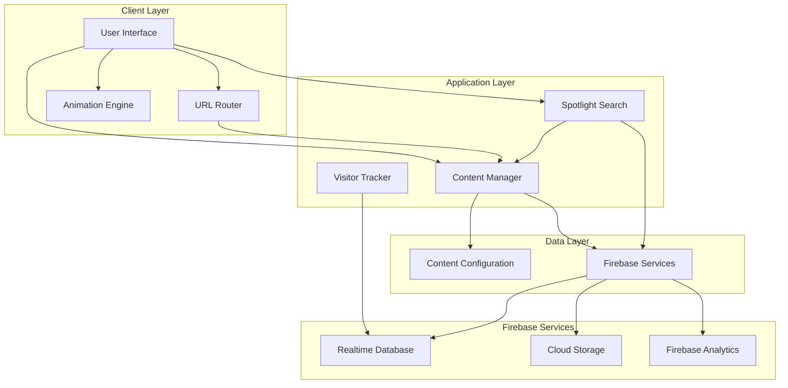

# Design Document: Portfolio Rebuild

## Overview

This design document specifies the technical architecture and implementation approach for rebuilding the portfolio website (uddhavbhople.in). The rebuild focuses on creating a modern, maintainable, and performant portfolio with professional animations, simplified content management, and preserved Firebase functionality.

### Design Goals

1. **Cyberpunk/Terminal Aesthetic**: Implement a dark, hacker-inspired visual theme with terminal-style interfaces and CRT effects
2. **Modern User Experience**: Deliver smooth, professional animations with glitch effects and glow interactions
3. **Maintainability**: Create a modular, well-organized codebase with clear separation of concerns
4. **Content Management**: Enable code-free monthly updates through configuration-driven content
5. **Data Preservation**: Migrate all existing portfolio data without loss
6. **Performance**: Achieve fast load times and smooth interactions across all devices
7. **Accessibility**: Ensure full WCAG AA compliance with reduced motion support

### Visual Design Direction

**Theme**: Cyberpunk/Terminal/Hacker Aesthetic
- **Color Palette**: 
  - Primary Background: Dark (#0a0a0a, #1a1a1a)
  - Accent Color: Neon Green (#00ff87)
  - Secondary Accents: Cyan, Purple, Pink
  - Text: Light gray (#e0e0e0) with green highlights
- **Typography**:
  - Monospace Font: JetBrains Mono (code/terminal elements)
  - Display Font: Syne (headings and hero text)
  - Fallbacks: Consolas, Monaco, Courier New
- **Visual Effects**:
  - CRT scanlines overlay
  - Vignette effects
  - Grid background pattern
  - Glitch text animations
  - Glow effects on hover
  - Blinking status indicators
  - Terminal cursor animations

### Technology Stack

- **Frontend**: HTML5, CSS3, JavaScript (ES6+)
- **Typography**: JetBrains Mono (monospace), Syne (display)
- **Animation**: CSS Animations, Intersection Observer API, requestAnimationFrame, Glitch Effects
- **Backend**: Firebase (Realtime Database, Storage, Analytics)
- **Build Tools**: Webpack/Vite for bundling and optimization
- **Deployment**: Firebase Hosting with custom domain
- **Version Control**: Git

## Architecture

### System Architecture

The portfolio system follows a modular, component-based architecture with clear separation between presentation, logic, and data layers.



### Directory Structure

```
portfolio-rebuild/
├── src/
│   ├── components/          # Reusable UI components
│   │   ├── header.js
│   │   ├── navigation.js
│   │   ├── project-card.js
│   │   ├── spotlight-search.js
│   │   ├── social-links.js
│   │   ├── terminal-window.js
│   │   └── glitch-text.js
│   ├── modules/             # Feature modules
│   │   ├── animation-engine.js
│   │   ├── content-manager.js
│   │   ├── router.js
│   │   ├── visitor-tracker.js
│   │   ├── firebase-integration.js
│   │   ├── typing-animation.js
│   │   └── glitch-effects.js
│   ├── styles/              # CSS stylesheets
│   │   ├── base.css         # Reset and base styles
│   │   ├── theme.css        # Cyberpunk theme variables
│   │   ├── animations.css   # Animation definitions
│   │   ├── effects.css      # CRT, scanlines, glitch effects
│   │   ├── layout.css       # Two-column layout and grid
│   │   ├── components.css   # Component styles
│   │   ├── terminal.css     # Terminal-style elements
│   │   └── responsive.css   # Media queries
│   ├── assets/              # Static assets
│   │   ├── images/
│   │   ├── icons/
│   │   └── fonts/
│   │       ├── JetBrainsMono/
│   │       └── Syne/
│   ├── config/              # Configuration files
│   │   ├── content.json     # Portfolio content data
│   │   ├── firebase.json    # Firebase configuration
│   │   └── site-config.json # Site-wide settings
│   ├── utils/               # Utility functions
│   │   ├── validators.js
│   │   ├── helpers.js
│   │   └── constants.js
│   └── main.js              # Application entry point
├── public/                  # Public assets
│   ├── index.html
│   ├── robots.txt
│   └── sitemap.xml
├── tools/                   # Build and migration tools
│   └── migrate-data.js      # Data migration script
├── tests/                   # Test files
│   ├── unit/
│   └── integration/
├── docs/                    # Documentation
│   └── README.md
├── package.json
├── webpack.config.js
└── .gitignore
```

## UI/UX Design Patterns

### Layout Structure

**Two-Column Design**:
- **Left Sidebar (Sticky)**: Personal information, contact details, social links, navigation
- **Right Content Area (Scrollable)**: Main content sections (About, Projects, Experience, Contact)
- **Responsive Breakpoint**: Collapses to single column on mobile/tablet (<1024px)

**Hero Section**:
- Large display name with glitch effect
- Terminal-style command prompt showing role/title
- Animated typing effect for bio/tagline
- Blinking status indicator (online/available)

**Navigation**:
- Terminal-style command buttons
- Active state with glow effect
- Smooth scroll to sections
- Keyboard shortcuts support (Cmd/Ctrl + number keys)

### Visual Hierarchy

**Typography Scale**:
- Hero Name: 3-4rem (Syne, glitch effect)
- Section Headings: 2rem (Syne, with terminal prompt prefix)
- Subsection Headings: 1.5rem (JetBrains Mono)
- Body Text: 1rem (JetBrains Mono)
- Code/Terminal: 0.875rem (JetBrains Mono)

**Color Usage**:
- Primary Actions: Neon Green (#00ff87)
- Links/Hover States: Cyan (#00d9ff)
- Warnings/Alerts: Pink/Magenta (#ff00ff)
- Success States: Green with glow
- Disabled States: Dimmed gray with reduced opacity

### Interactive Elements

**Buttons**:
- Terminal-style with border and transparent background
- Hover: Fill with accent color + glow effect
- Active: Scale down slightly + increased glow
- Disabled: Reduced opacity + no hover effects

**Links**:
- Underline on hover with glow effect
- Color shift from gray to accent green
- Smooth transition (0.3s ease)

**Cards (Projects, Skills, Experience)**:
- Dark background with subtle border
- Hover: Lift effect (translateY -5px) + glow shadow
- Scan line animation on hover
- Corner accent indicators

**Form Inputs**:
- Terminal-style with monospace font
- Focus: Accent border + glow effect
- Placeholder: Dimmed text with terminal prompt
- Validation: Color-coded borders (green/red)

### Animation Patterns

**Page Load**:
1. Scanlines fade in
2. Grid background appears
3. Sidebar slides in from left
4. Hero name glitches in
5. Content fades up with stagger

**Scroll Animations**:
- Fade up + slight scale for cards
- Staggered animation for lists (100ms delay between items)
- Progress indicators for long content
- Parallax effect on background elements

**Interaction Feedback**:
- Hover: Glow + transform
- Click: Brief glitch effect
- Success: Green pulse
- Error: Red shake + glitch

**Transitions**:
- Section changes: Fade + slide
- Modal open/close: Scale + fade
- Menu toggle: Slide with easing

### Micro-interactions

**Status Indicators**:
- Blinking dot for online status
- Pulsing glow for notifications
- Loading: Terminal-style spinner or progress bar

**Cursor Effects**:
- Crosshair cursor globally
- Pointer for interactive elements
- Text cursor for inputs

**Hover States**:
- Project cards: Lift + glow + scan animation
- Buttons: Fill + glow
- Links: Underline + color shift
- Images: Slight zoom + border glow

### Accessibility Features

**Keyboard Navigation**:
- Tab order follows visual hierarchy
- Focus indicators with high contrast
- Skip to content link
- Keyboard shortcuts for main actions

**Screen Reader Support**:
- Semantic HTML structure
- ARIA labels for interactive elements
- Alt text for all images
- Descriptive link text

**Reduced Motion**:
- Disable glitch effects
- Remove scanlines
- Simplify transitions
- Static cursor instead of blinking

**Color Contrast**:
- Text: Minimum 7:1 ratio (AAA)
- Interactive elements: Minimum 4.5:1 ratio (AA)
- Focus indicators: High contrast borders

### Responsive Design

**Breakpoints**:
- Desktop: 1200px+
- Laptop: 1024px - 1199px
- Tablet: 768px - 1023px
- Mobile: < 768px

**Mobile Adaptations**:
- Single column layout
- Collapsible sidebar
- Larger touch targets (min 44x44px)
- Simplified animations
- Reduced glow effects for performance

**Touch Interactions**:
- Tap feedback with brief glow
- Swipe gestures for navigation
- Pull to refresh (optional)
- Long press for context menus

## Components and Interfaces

### 1. Animation Engine

**Purpose**: Manages all animations throughout the portfolio, including entrance animations, scroll-based animations, glitch effects, and interaction feedback.

**Interface**:
```javascript
class AnimationEngine {
  // Initialize animation system
  init(options)
  
  // Register elements for animation
  registerElement(element, animationType, options)
  
  // Trigger animation on element
  animate(element, animationType)
  
  // Handle scroll-based animations
  observeScrollAnimations()
  
  // Apply glitch effect
  applyGlitchEffect(element, intensity)
  
  // Apply glow effect
  applyGlowEffect(element, color)
  
  // Check for reduced motion preference
  shouldReduceMotion()
  
  // Cleanup and destroy
  destroy()
}
```

**Key Features**:
- Uses Intersection Observer API for scroll-based animations
- Respects `prefers-reduced-motion` media query
- Maintains 60fps through requestAnimationFrame
- Supports staggered animations for element groups
- Provides cyberpunk-themed animation presets
- Implements glitch text effects
- Handles glow and transform animations

**Animation Types**:
- **Entrance**: fadeIn, slideUp, slideDown, scaleIn, glitchIn
- **Scroll**: parallax, fadeInOnScroll, slideInOnScroll
- **Interaction**: hover glow, focus, click feedback, transform
- **Transition**: page transitions, section changes
- **Effects**: glitch, scanlines, typing animation, blinking cursor

### 2. Content Manager

**Purpose**: Loads, validates, and provides access to portfolio content from configuration files.

**Interface**:
```javascript
class ContentManager {
  // Load content from configuration
  async loadContent()
  
  // Get all projects
  getProjects(filters)
  
  // Get project by ID
  getProjectById(id)
  
  // Get personal information
  getPersonalInfo()
  
  // Get technologies
  getTechnologies(category)
  
  // Get career information
  getCareerInfo()
  
  // Validate content structure
  validateContent(content)
  
  // Update content (for admin)
  updateContent(section, data)
}
```

**Content Schema**:
```json
{
  "personal": {
    "name": "string",
    "title": "string",
    "email": "string",
    "phone": "string",
    "location": "string",
    "birthday": "string",
    "bio": "string",
    "resumeUrl": "string"
  },
  "social": {
    "whatsapp": "string",
    "instagram": "string",
    "linkedin": "string",
    "github": "string"
  },
  "projects": [
    {
      "id": "string",
      "title": "string",
      "description": "string",
      "image": "string",
      "category": "string",
      "technologies": ["string"],
      "links": {
        "demo": "string",
        "github": "string"
      },
      "featured": "boolean"
    }
  ],
  "technologies": [
    {
      "name": "string",
      "category": "string",
      "icon": "string",
      "description": "string"
    }
  ],
  "career": [
    {
      "title": "string",
      "company": "string",
      "period": "string",
      "description": "string"
    }
  ],
  "certificates": [
    {
      "title": "string",
      "issuer": "string",
      "date": "string",
      "url": "string"
    }
  ]
}
```

### 3. URL Router

**Purpose**: Manages client-side routing, deep linking, and URL state management.

**Interface**:
```javascript
class Router {
  // Initialize router
  init(routes)
  
  // Navigate to route
  navigate(path, state)
  
  // Get current route
  getCurrentRoute()
  
  // Register route handler
  registerRoute(path, handler)
  
  // Handle browser back/forward
  handlePopState(event)
  
  // Generate shareable URL
  generateShareableUrl(section, params)
}
```

**Route Structure**:
- `/` - Home section
- `/projects` - Projects section
- `/projects/:id` - Individual project
- `/about` - About section
- `/contact` - Contact section
- `/search?q=:query` - Search results

### 4. Firebase Integration

**Purpose**: Manages all Firebase service connections including Realtime Database, Storage, and Analytics.

**Interface**:
```javascript
class FirebaseIntegration {
  // Initialize Firebase
  init(config)
  
  // Database operations
  async writeData(path, data)
  async readData(path)
  async updateData(path, updates)
  
  // Storage operations
  async uploadFile(path, file)
  async getFileUrl(path)
  
  // Analytics operations
  logEvent(eventName, params)
  logPageView(pageName)
  
  // Connection status
  isConnected()
  onConnectionChange(callback)
}
```

**Firebase Configuration**:
```javascript
{
  apiKey: "...",
  authDomain: "...",
  databaseURL: "...",
  projectId: "...",
  storageBucket: "...",
  messagingSenderId: "...",
  appId: "...",
  measurementId: "..."
}
```

### 5. Visitor Tracker

**Purpose**: Records and analyzes visitor behavior while respecting privacy.

**Interface**:
```javascript
class VisitorTracker {
  // Initialize tracker
  init(firebaseIntegration)
  
  // Track page visit
  trackVisit()
  
  // Track navigation event
  trackNavigation(from, to)
  
  // Track interaction
  trackInteraction(type, target)
  
  // Get visitor statistics
  async getStatistics()
  
  // Check privacy consent
  hasConsent()
}
```

**Tracked Data**:
- Visit timestamp
- Page views
- Section navigation
- Time spent on sections
- Device type and viewport size
- Referrer information

### 6. Spotlight Search

**Purpose**: Provides AI-powered search functionality across portfolio content.

**Interface**:
```javascript
class SpotlightSearch {
  // Initialize search
  init(contentManager, firebaseIntegration)
  
  // Perform search
  async search(query)
  
  // Index content for search
  indexContent(content)
  
  // Show search interface
  show()
  
  // Hide search interface
  hide()
  
  // Handle keyboard shortcuts
  handleKeyboardShortcut(event)
}
```

**Search Features**:
- Full-text search across projects, skills, and experience
- Fuzzy matching for typo tolerance
- Result ranking by relevance
- Keyboard navigation (Cmd/Ctrl + K to open)
- Search history

### 7. Migration Tool

**Purpose**: Extracts data from the current portfolio and transforms it for the new structure.

**Interface**:
```javascript
class MigrationTool {
  // Extract data from current portfolio
  async extractData(sourceUrl)
  
  // Transform data to new schema
  transformData(rawData)
  
  // Validate migrated data
  validateMigration(data)
  
  // Generate migration report
  generateReport(data)
  
  // Export to configuration file
  exportToConfig(data, outputPath)
}
```

**Migration Process**:
1. Parse current portfolio HTML
2. Extract structured data (projects, personal info, technologies)
3. Download and organize images
4. Transform to new content schema
5. Validate completeness
6. Generate content.json
7. Create migration report

### 8. Glitch Text Component

**Purpose**: Creates cyberpunk-style glitch effects on text elements, particularly for hero sections and headings.

**Interface**:
```javascript
class GlitchText {
  // Initialize glitch effect on element
  init(element, options)
  
  // Start glitch animation
  start()
  
  // Stop glitch animation
  stop()
  
  // Configure glitch intensity
  setIntensity(level)
  
  // Apply random glitch
  applyRandomGlitch()
}
```

**Key Features**:
- Random character replacement
- RGB color shift effects
- Horizontal displacement
- Configurable intensity and frequency
- Performance-optimized with requestAnimationFrame

### 9. Terminal Window Component

**Purpose**: Renders terminal-style UI elements with command prompts and typing animations.

**Interface**:
```javascript
class TerminalWindow {
  // Initialize terminal window
  init(element, options)
  
  // Write text with typing effect
  typeText(text, speed)
  
  // Add command prompt
  addPrompt(command)
  
  // Clear terminal
  clear()
  
  // Add blinking cursor
  showCursor()
}
```

**Key Features**:
- Typing animation effect
- Blinking cursor
- Command prompt styling
- Monospace font rendering
- Terminal color schemes

### 10. CRT Effects Module

**Purpose**: Applies retro CRT monitor effects including scanlines, vignette, and screen curvature.

**Interface**:
```javascript
class CRTEffects {
  // Initialize CRT effects
  init(options)
  
  // Apply scanlines overlay
  applyScanlines(intensity)
  
  // Apply vignette effect
  applyVignette(strength)
  
  // Apply screen flicker
  applyFlicker(frequency)
  
  // Toggle effects on/off
  toggle(enabled)
}
```

**Key Features**:
- CSS-based scanlines overlay
- Vignette gradient
- Optional screen flicker
- Performance-optimized
- Respects reduced motion preferences

## Data Models

### Project Model

```javascript
{
  id: "string",              // Unique identifier
  title: "string",           // Project title
  description: "string",     // Detailed description
  shortDescription: "string", // Brief summary
  image: "string",           // Main project image URL
  images: ["string"],        // Additional images
  category: "string",        // Project category
  technologies: ["string"],  // Technologies used
  links: {
    demo: "string",          // Live demo URL
    github: "string",        // GitHub repository
    case_study: "string"     // Case study URL
  },
  featured: boolean,         // Featured project flag
  date: "string",            // Project date
  status: "string"           // active, completed, archived
}
```

### Technology Model

```javascript
{
  name: "string",            // Technology name
  category: "string",        // cloud, devops, language, framework, database
  icon: "string",            // Icon URL or class
  description: "string",     // Experience description
  proficiency: "string",     // beginner, intermediate, advanced, expert
  yearsOfExperience: number  // Years of experience
}
```

### Career Model

```javascript
{
  id: "string",              // Unique identifier
  title: "string",           // Job title
  company: "string",         // Company name
  period: "string",          // Time period
  startDate: "string",       // Start date
  endDate: "string",         // End date (or "Present")
  description: "string",     // Role description
  achievements: ["string"],  // Key achievements
  technologies: ["string"]   // Technologies used
}
```

### Certificate Model

```javascript
{
  id: "string",              // Unique identifier
  title: "string",           // Certificate title
  issuer: "string",          // Issuing organization
  date: "string",            // Issue date
  expiryDate: "string",      // Expiry date (optional)
  credentialId: "string",    // Credential ID
  url: "string",             // Verification URL
  image: "string"            // Certificate image
}
```

### Visitor Analytics Model

```javascript
{
  sessionId: "string",       // Unique session ID
  timestamp: number,         // Visit timestamp
  page: "string",            // Current page
  referrer: "string",        // Referrer URL
  device: {
    type: "string",          // mobile, tablet, desktop
    os: "string",            // Operating system
    browser: "string"        // Browser name
  },
  viewport: {
    width: number,
    height: number
  },
  events: [
    {
      type: "string",        // Event type
      target: "string",      // Event target
      timestamp: number      // Event timestamp
    }
  ]
}
```


## Implementation Details

### Cyberpunk Theme Implementation

The cyberpunk/terminal aesthetic is implemented through CSS custom properties and modular styling:

**CSS Theme Variables**:
```css
:root {
  /* Color Palette */
  --color-bg-primary: #0a0a0a;
  --color-bg-secondary: #1a1a1a;
  --color-bg-tertiary: #2a2a2a;
  --color-accent-primary: #00ff87;
  --color-accent-secondary: #00d9ff;
  --color-accent-tertiary: #ff00ff;
  --color-text-primary: #e0e0e0;
  --color-text-secondary: #a0a0a0;
  --color-text-accent: #00ff87;
  
  /* Typography */
  --font-mono: 'JetBrains Mono', Consolas, Monaco, 'Courier New', monospace;
  --font-display: 'Syne', -apple-system, BlinkMacSystemFont, sans-serif;
  
  /* Effects */
  --glow-intensity: 0 0 10px var(--color-accent-primary),
                     0 0 20px var(--color-accent-primary),
                     0 0 30px var(--color-accent-primary);
  --scanline-opacity: 0.1;
  --grid-size: 20px;
  
  /* Layout */
  --sidebar-width: 350px;
  --content-max-width: 1200px;
  --spacing-unit: 1rem;
}
```

**Grid Background Pattern**:
```css
body::before {
  content: '';
  position: fixed;
  top: 0;
  left: 0;
  width: 100%;
  height: 100%;
  background-image: 
    linear-gradient(rgba(0, 255, 135, 0.03) 1px, transparent 1px),
    linear-gradient(90deg, rgba(0, 255, 135, 0.03) 1px, transparent 1px);
  background-size: var(--grid-size) var(--grid-size);
  pointer-events: none;
  z-index: -1;
}
```

**CRT Scanlines Effect**:
```css
.scanlines {
  position: fixed;
  top: 0;
  left: 0;
  width: 100%;
  height: 100%;
  pointer-events: none;
  background: repeating-linear-gradient(
    0deg,
    rgba(0, 0, 0, 0.15),
    rgba(0, 0, 0, 0.15) 1px,
    transparent 1px,
    transparent 2px
  );
  z-index: 9999;
}

@media (prefers-reduced-motion: reduce) {
  .scanlines {
    display: none;
  }
}
```

**Vignette Effect**:
```css
body::after {
  content: '';
  position: fixed;
  top: 0;
  left: 0;
  width: 100%;
  height: 100%;
  background: radial-gradient(
    ellipse at center,
    transparent 0%,
    rgba(0, 0, 0, 0.7) 100%
  );
  pointer-events: none;
  z-index: -1;
}
```

### Layout System

**Two-Column Layout**:
```css
.portfolio-container {
  display: grid;
  grid-template-columns: var(--sidebar-width) 1fr;
  min-height: 100vh;
  gap: 2rem;
}

.sidebar {
  position: sticky;
  top: 0;
  height: 100vh;
  overflow-y: auto;
  padding: 2rem;
  background: var(--color-bg-secondary);
  border-right: 1px solid var(--color-accent-primary);
}

.main-content {
  padding: 2rem;
  overflow-y: auto;
}

@media (max-width: 1024px) {
  .portfolio-container {
    grid-template-columns: 1fr;
  }
  
  .sidebar {
    position: relative;
    height: auto;
  }
}
```

### Animation System Implementation

**Glitch Text Effect**:
```css
@keyframes glitch {
  0% {
    transform: translate(0);
    text-shadow: 2px 2px #ff00ff, -2px -2px #00ffff;
  }
  20% {
    transform: translate(-2px, 2px);
    text-shadow: -2px -2px #ff00ff, 2px 2px #00ffff;
  }
  40% {
    transform: translate(-2px, -2px);
    text-shadow: 2px -2px #ff00ff, -2px 2px #00ffff;
  }
  60% {
    transform: translate(2px, 2px);
    text-shadow: -2px 2px #ff00ff, 2px -2px #00ffff;
  }
  80% {
    transform: translate(2px, -2px);
    text-shadow: 2px 2px #ff00ff, -2px -2px #00ffff;
  }
  100% {
    transform: translate(0);
    text-shadow: 2px 2px #ff00ff, -2px -2px #00ffff;
  }
}

.glitch-text {
  animation: glitch 0.3s infinite;
  animation-timing-function: steps(2, end);
}

.glitch-text:hover {
  animation-duration: 0.1s;
}
```

**Glow Effect on Hover**:
```css
.glow-on-hover {
  transition: all 0.3s ease;
}

.glow-on-hover:hover {
  color: var(--color-accent-primary);
  text-shadow: var(--glow-intensity);
  transform: translateY(-2px);
}
```

**Typing Animation**:
```css
@keyframes typing {
  from { width: 0; }
  to { width: 100%; }
}

@keyframes blink-caret {
  from, to { border-color: transparent; }
  50% { border-color: var(--color-accent-primary); }
}

.typing-text {
  overflow: hidden;
  border-right: 2px solid var(--color-accent-primary);
  white-space: nowrap;
  animation: 
    typing 3.5s steps(40, end),
    blink-caret 0.75s step-end infinite;
}
```

**Blinking Status Indicator**:
```css
@keyframes blink {
  0%, 49% { opacity: 1; }
  50%, 100% { opacity: 0; }
}

.status-indicator {
  display: inline-block;
  width: 8px;
  height: 8px;
  border-radius: 50%;
  background: var(--color-accent-primary);
  animation: blink 1s infinite;
  box-shadow: 0 0 10px var(--color-accent-primary);
}
```

### Component Styling

**Terminal Window**:
```css
.terminal-window {
  background: var(--color-bg-secondary);
  border: 1px solid var(--color-accent-primary);
  border-radius: 4px;
  padding: 1rem;
  font-family: var(--font-mono);
  box-shadow: 0 0 20px rgba(0, 255, 135, 0.2);
}

.terminal-header {
  display: flex;
  gap: 0.5rem;
  margin-bottom: 1rem;
  padding-bottom: 0.5rem;
  border-bottom: 1px solid var(--color-accent-primary);
}

.terminal-dot {
  width: 12px;
  height: 12px;
  border-radius: 50%;
  background: var(--color-accent-primary);
}

.terminal-prompt {
  color: var(--color-accent-primary);
}

.terminal-prompt::before {
  content: '$ ';
}
```

**Project Cards**:
```css
.project-card {
  background: var(--color-bg-secondary);
  border: 1px solid rgba(0, 255, 135, 0.3);
  border-radius: 8px;
  padding: 1.5rem;
  transition: all 0.3s ease;
  position: relative;
  overflow: hidden;
}

.project-card::before {
  content: '';
  position: absolute;
  top: 0;
  left: -100%;
  width: 100%;
  height: 100%;
  background: linear-gradient(
    90deg,
    transparent,
    rgba(0, 255, 135, 0.1),
    transparent
  );
  transition: left 0.5s ease;
}

.project-card:hover {
  border-color: var(--color-accent-primary);
  box-shadow: 0 0 30px rgba(0, 255, 135, 0.3);
  transform: translateY(-5px);
}

.project-card:hover::before {
  left: 100%;
}
```

**Badge/Achievement Cards**:
```css
.badge-card {
  background: var(--color-bg-tertiary);
  border: 2px solid var(--color-accent-primary);
  border-radius: 12px;
  padding: 1rem;
  text-align: center;
  position: relative;
  overflow: hidden;
}

.badge-card::after {
  content: '';
  position: absolute;
  top: -50%;
  left: -50%;
  width: 200%;
  height: 200%;
  background: conic-gradient(
    from 0deg,
    transparent,
    var(--color-accent-primary),
    transparent 30%
  );
  animation: rotate 4s linear infinite;
}

@keyframes rotate {
  100% { transform: rotate(360deg); }
}

.badge-content {
  position: relative;
  z-index: 1;
}
```

**Contact Form Terminal Style**:
```css
.contact-form {
  background: var(--color-bg-secondary);
  border: 1px solid var(--color-accent-primary);
  padding: 2rem;
  font-family: var(--font-mono);
}

.form-input {
  background: var(--color-bg-primary);
  border: 1px solid rgba(0, 255, 135, 0.3);
  color: var(--color-text-primary);
  padding: 0.75rem;
  font-family: var(--font-mono);
  transition: all 0.3s ease;
}

.form-input:focus {
  outline: none;
  border-color: var(--color-accent-primary);
  box-shadow: 0 0 10px rgba(0, 255, 135, 0.3);
}

.form-button {
  background: transparent;
  border: 2px solid var(--color-accent-primary);
  color: var(--color-accent-primary);
  padding: 0.75rem 2rem;
  font-family: var(--font-mono);
  cursor: crosshair;
  transition: all 0.3s ease;
}

.form-button:hover {
  background: var(--color-accent-primary);
  color: var(--color-bg-primary);
  box-shadow: 0 0 20px var(--color-accent-primary);
}
```

### Cursor Customization

```css
body {
  cursor: crosshair;
}

a, button {
  cursor: pointer;
}

.terminal-window {
  cursor: text;
}
```

### Accessibility and Reduced Motion

```css
@media (prefers-reduced-motion: reduce) {
  *,
  *::before,
  *::after {
    animation-duration: 0.01ms !important;
    animation-iteration-count: 1 !important;
    transition-duration: 0.01ms !important;
  }
  
  .glitch-text {
    animation: none;
  }
  
  .scanlines {
    display: none;
  }
  
  .typing-text {
    animation: none;
    border-right: none;
    width: 100%;
  }
}
```

### Smooth Scroll Behavior

```css
html {
  scroll-behavior: smooth;
}

@media (prefers-reduced-motion: reduce) {
  html {
    scroll-behavior: auto;
  }
}
```

### Animation System Implementation (Continued)

The animation system uses a combination of CSS animations and JavaScript orchestration:

**JavaScript Animation Orchestration**:
```javascript
class AnimationEngine {
  constructor() {
    this.observers = new Map();
    this.reducedMotion = window.matchMedia('(prefers-reduced-motion: reduce)').matches;
  }

  init() {
    this.setupScrollAnimations();
    this.setupGlitchEffects();
    this.setupTypingAnimations();
  }

  setupScrollAnimations() {
    if (this.reducedMotion) return;

    const observer = new IntersectionObserver((entries) => {
      entries.forEach(entry => {
        if (entry.isIntersecting) {
          entry.target.classList.add('visible');
        }
      });
    }, {
      threshold: 0.1,
      rootMargin: '0px 0px -100px 0px'
    });

    document.querySelectorAll('.animate-on-scroll').forEach(el => {
      observer.observe(el);
    });
  }

  setupGlitchEffects() {
    if (this.reducedMotion) return;

    document.querySelectorAll('.glitch-text').forEach(el => {
      setInterval(() => {
        if (Math.random() > 0.95) {
          el.style.animation = 'none';
          setTimeout(() => {
            el.style.animation = '';
          }, 100);
        }
      }, 3000);
    });
  }

  setupTypingAnimations() {
    if (this.reducedMotion) return;

    document.querySelectorAll('.typing-text').forEach(el => {
      const text = el.textContent;
      el.textContent = '';
      let i = 0;
      
      const typeWriter = () => {
        if (i < text.length) {
          el.textContent += text.charAt(i);
          i++;
          setTimeout(typeWriter, 50 + Math.random() * 50);
        }
      };
      
      typeWriter();
    });
  }
}
```

**Intersection Observer for Scroll Animations**:
```javascript
const observeElements = () => {
  const observer = new IntersectionObserver((entries) => {
    entries.forEach(entry => {
      if (entry.isIntersecting) {
        entry.target.classList.add('animate-in');
        
        // Stagger child animations
        const children = entry.target.querySelectorAll('.stagger-item');
        children.forEach((child, index) => {
          setTimeout(() => {
            child.classList.add('animate-in');
          }, index * 100);
        });
      }
    });
  }, {
    threshold: 0.15,
    rootMargin: '0px 0px -50px 0px'
  });

  document.querySelectorAll('.observe-animation').forEach(el => {
    observer.observe(el);
  });
};
```