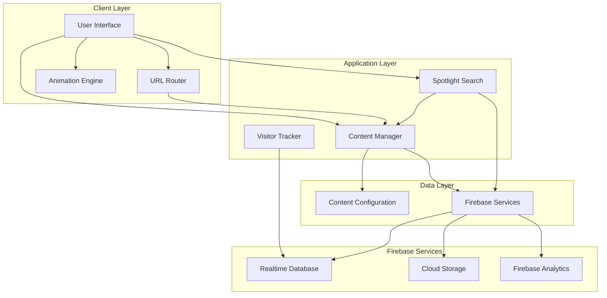

# Design Document: Portfolio Rebuild

## Overview

This design document specifies the technical architecture and implementation approach for rebuilding the portfolio website (uddhavbhople.in). The rebuild focuses on creating a modern, maintainable, and performant portfolio with professional animations, simplified content management, and preserved Firebase functionality.

### Design Goals

1. **Modern User Experience**: Implement smooth, professional animations using CSS animations and JavaScript
2. **Maintainability**: Create a modular, well-organized codebase with clear separation of concerns
3. **Content Management**: Enable code-free monthly updates through configuration-driven content
4. **Data Preservation**: Migrate all existing portfolio data without loss
5. **Performance**: Achieve fast load times and smooth interactions across all devices
6. **Accessibility**: Ensure full WCAG AA compliance for all users

### Technology Stack

- **Frontend**: HTML5, CSS3, JavaScript (ES6+)
- **Animation**: CSS Animations, Intersection Observer API, requestAnimationFrame
- **Backend**: Firebase (Realtime Database, Storage, Analytics)
- **Build Tools**: Webpack/Vite for bundling and optimization
- **Deployment**: Firebase Hosting with custom domain
- **Version Control**: Git

## Architecture

### System Architecture

The portfolio system follows a modular, component-based architecture with clear separation between presentation, logic, and data layers.



### Directory Structure

```
portfolio-rebuild/
├── src/
│   ├── components/          # Reusable UI components
│   │   ├── header.js
│   │   ├── navigation.js
│   │   ├── project-card.js
│   │   ├── spotlight-search.js
│   │   └── social-links.js
│   ├── modules/             # Feature modules
│   │   ├── animation-engine.js
│   │   ├── content-manager.js
│   │   ├── router.js
│   │   ├── visitor-tracker.js
│   │   └── firebase-integration.js
│   ├── styles/              # CSS stylesheets
│   │   ├── base.css         # Reset and base styles
│   │   ├── animations.css   # Animation definitions
│   │   ├── layout.css       # Layout and grid
│   │   ├── components.css   # Component styles
│   │   └── responsive.css   # Media queries
│   ├── assets/              # Static assets
│   │   ├── images/
│   │   ├── icons/
│   │   └── fonts/
│   ├── config/              # Configuration files
│   │   ├── content.json     # Portfolio content data
│   │   ├── firebase.json    # Firebase configuration
│   │   └── site-config.json # Site-wide settings
│   ├── utils/               # Utility functions
│   │   ├── validators.js
│   │   ├── helpers.js
│   │   └── constants.js
│   └── main.js              # Application entry point
├── public/                  # Public assets
│   ├── index.html
│   ├── robots.txt
│   └── sitemap.xml
├── tools/                   # Build and migration tools
│   └── migrate-data.js      # Data migration script
├── tests/                   # Test files
│   ├── unit/
│   └── integration/
├── docs/                    # Documentation
│   └── README.md
├── package.json
├── webpack.config.js
└── .gitignore
```

## Components and Interfaces

### 1. Animation Engine

**Purpose**: Manages all animations throughout the portfolio, including entrance animations, scroll-based animations, and interaction feedback.

**Interface**:
```javascript
class AnimationEngine {
  // Initialize animation system
  init(options)
  
  // Register elements for animation
  registerElement(element, animationType, options)
  
  // Trigger animation on element
  animate(element, animationType)
  
  // Handle scroll-based animations
  observeScrollAnimations()
  
  // Check for reduced motion preference
  shouldReduceMotion()
  
  // Cleanup and destroy
  destroy()
}
```

**Key Features**:
- Uses Intersection Observer API for scroll-based animations
- Respects `prefers-reduced-motion` media query
- Maintains 60fps through requestAnimationFrame
- Supports staggered animations for element groups
- Provides animation presets (fadeIn, slideUp, scaleIn, etc.)

**Animation Types**:
- **Entrance**: fadeIn, slideUp, slideDown, scaleIn
- **Scroll**: parallax, fadeInOnScroll, slideInOnScroll
- **Interaction**: hover, focus, click feedback
- **Transition**: page transitions, section changes

### 2. Content Manager

**Purpose**: Loads, validates, and provides access to portfolio content from configuration files.

**Interface**:
```javascript
class ContentManager {
  // Load content from configuration
  async loadContent()
  
  // Get all projects
  getProjects(filters)
  
  // Get project by ID
  getProjectById(id)
  
  // Get personal information
  getPersonalInfo()
  
  // Get technologies
  getTechnologies(category)
  
  // Get career information
  getCareerInfo()
  
  // Validate content structure
  validateContent(content)
  
  // Update content (for admin)
  updateContent(section, data)
}
```

**Content Schema**:
```json
{
  "personal": {
    "name": "string",
    "title": "string",
    "email": "string",
    "phone": "string",
    "location": "string",
    "birthday": "string",
    "bio": "string",
    "resumeUrl": "string"
  },
  "social": {
    "whatsapp": "string",
    "instagram": "string",
    "linkedin": "string",
    "github": "string"
  },
  "projects": [
    {
      "id": "string",
      "title": "string",
      "description": "string",
      "image": "string",
      "category": "string",
      "technologies": ["string"],
      "links": {
        "demo": "string",
        "github": "string"
      },
      "featured": "boolean"
    }
  ],
  "technologies": [
    {
      "name": "string",
      "category": "string",
      "icon": "string",
      "description": "string"
    }
  ],
  "career": [
    {
      "title": "string",
      "company": "string",
      "period": "string",
      "description": "string"
    }
  ],
  "certificates": [
    {
      "title": "string",
      "issuer": "string",
      "date": "string",
      "url": "string"
    }
  ]
}
```

### 3. URL Router

**Purpose**: Manages client-side routing, deep linking, and URL state management.

**Interface**:
```javascript
class Router {
  // Initialize router
  init(routes)
  
  // Navigate to route
  navigate(path, state)
  
  // Get current route
  getCurrentRoute()
  
  // Register route handler
  registerRoute(path, handler)
  
  // Handle browser back/forward
  handlePopState(event)
  
  // Generate shareable URL
  generateShareableUrl(section, params)
}
```

**Route Structure**:
- `/` - Home section
- `/projects` - Projects section
- `/projects/:id` - Individual project
- `/about` - About section
- `/contact` - Contact section
- `/search?q=:query` - Search results

### 4. Firebase Integration

**Purpose**: Manages all Firebase service connections including Realtime Database, Storage, and Analytics.

**Interface**:
```javascript
class FirebaseIntegration {
  // Initialize Firebase
  init(config)
  
  // Database operations
  async writeData(path, data)
  async readData(path)
  async updateData(path, updates)
  
  // Storage operations
  async uploadFile(path, file)
  async getFileUrl(path)
  
  // Analytics operations
  logEvent(eventName, params)
  logPageView(pageName)
  
  // Connection status
  isConnected()
  onConnectionChange(callback)
}
```

**Firebase Configuration**:
```javascript
{
  apiKey: "...",
  authDomain: "...",
  databaseURL: "...",
  projectId: "...",
  storageBucket: "...",
  messagingSenderId: "...",
  appId: "...",
  measurementId: "..."
}
```

### 5. Visitor Tracker

**Purpose**: Records and analyzes visitor behavior while respecting privacy.

**Interface**:
```javascript
class VisitorTracker {
  // Initialize tracker
  init(firebaseIntegration)
  
  // Track page visit
  trackVisit()
  
  // Track navigation event
  trackNavigation(from, to)
  
  // Track interaction
  trackInteraction(type, target)
  
  // Get visitor statistics
  async getStatistics()
  
  // Check privacy consent
  hasConsent()
}
```

**Tracked Data**:
- Visit timestamp
- Page views
- Section navigation
- Time spent on sections
- Device type and viewport size
- Referrer information

### 6. Spotlight Search

**Purpose**: Provides AI-powered search functionality across portfolio content.

**Interface**:
```javascript
class SpotlightSearch {
  // Initialize search
  init(contentManager, firebaseIntegration)
  
  // Perform search
  async search(query)
  
  // Index content for search
  indexContent(content)
  
  // Show search interface
  show()
  
  // Hide search interface
  hide()
  
  // Handle keyboard shortcuts
  handleKeyboardShortcut(event)
}
```

**Search Features**:
- Full-text search across projects, skills, and experience
- Fuzzy matching for typo tolerance
- Result ranking by relevance
- Keyboard navigation (Cmd/Ctrl + K to open)
- Search history

### 7. Migration Tool

**Purpose**: Extracts data from the current portfolio and transforms it for the new structure.

**Interface**:
```javascript
class MigrationTool {
  // Extract data from current portfolio
  async extractData(sourceUrl)
  
  // Transform data to new schema
  transformData(rawData)
  
  // Validate migrated data
  validateMigration(data)
  
  // Generate migration report
  generateReport(data)
  
  // Export to configuration file
  exportToConfig(data, outputPath)
}
```

**Migration Process**:
1. Parse current portfolio HTML
2. Extract structured data (projects, personal info, technologies)
3. Download and organize images
4. Transform to new content schema
5. Validate completeness
6. Generate content.json
7. Create migration report

## Data Models

### Project Model

```javascript
{
  id: "string",              // Unique identifier
  title: "string",           // Project title
  description: "string",     // Detailed description
  shortDescription: "string", // Brief summary
  image: "string",           // Main project image URL
  images: ["string"],        // Additional images
  category: "string",        // Project category
  technologies: ["string"],  // Technologies used
  links: {
    demo: "string",          // Live demo URL
    github: "string",        // GitHub repository
    case_study: "string"     // Case study URL
  },
  featured: boolean,         // Featured project flag
  date: "string",            // Project date
  status: "string"           // active, completed, archived
}
```

### Technology Model

```javascript
{
  name: "string",            // Technology name
  category: "string",        // cloud, devops, language, framework, database
  icon: "string",            // Icon URL or class
  description: "string",     // Experience description
  proficiency: "string",     // beginner, intermediate, advanced, expert
  yearsOfExperience: number  // Years of experience
}
```

### Career Model

```javascript
{
  id: "string",              // Unique identifier
  title: "string",           // Job title
  company: "string",         // Company name
  period: "string",          // Time period
  startDate: "string",       // Start date
  endDate: "string",         // End date (or "Present")
  description: "string",     // Role description
  achievements: ["string"],  // Key achievements
  technologies: ["string"]   // Technologies used
}
```

### Certificate Model

```javascript
{
  id: "string",              // Unique identifier
  title: "string",           // Certificate title
  issuer: "string",          // Issuing organization
  date: "string",            // Issue date
  expiryDate: "string",      // Expiry date (optional)
  credentialId: "string",    // Credential ID
  url: "string",             // Verification URL
  image: "string"            // Certificate image
}
```

### Visitor Analytics Model

```javascript
{
  sessionId: "string",       // Unique session ID
  timestamp: number,         // Visit timestamp
  page: "string",            // Current page
  referrer: "string",        // Referrer URL
  device: {
    type: "string",          // mobile, tablet, desktop
    os: "string",            // Operating system
    browser: "string"        // Browser name
  },
  viewport: {
    width: number,
    height: number
  },
  events: [
    {
      type: "string",        // Event type
      target: "string",      // Event target
      timestamp: number      // Event timestamp
    }
  ]
}
```


## Implementation Details

### Animation System Implementation

The animation system uses a combination of CSS animations and JavaScript orchestration:

**CSS Animation Classes**:
```css
/* Entrance Animations */
.fade-in {
  animation: fadeIn 0.6s ease-out forwards;
}

.slide-up {
  animation: slideUp 0.6s ease-out forwards;
}

.scale-in {
  animation: scaleIn 0.5s ease-out forwards;
}

/* Scroll Animations */
.animate-on-scroll {
  opacity: 0;
  transform: translateY(30px);
  transition: opacity 0.6s ease-out, transform 0.6s ease-out;
}

.animate-on-scroll.visible {
  opacity: 1;
  transform: translateY(0);
}

/* Interaction Animations */
.hover-lift {
  transition: transform 0.3s ease;
}

.hover-lift:hover {
  transform: translateY(-5px);
}
```

**JavaScript Animation Co